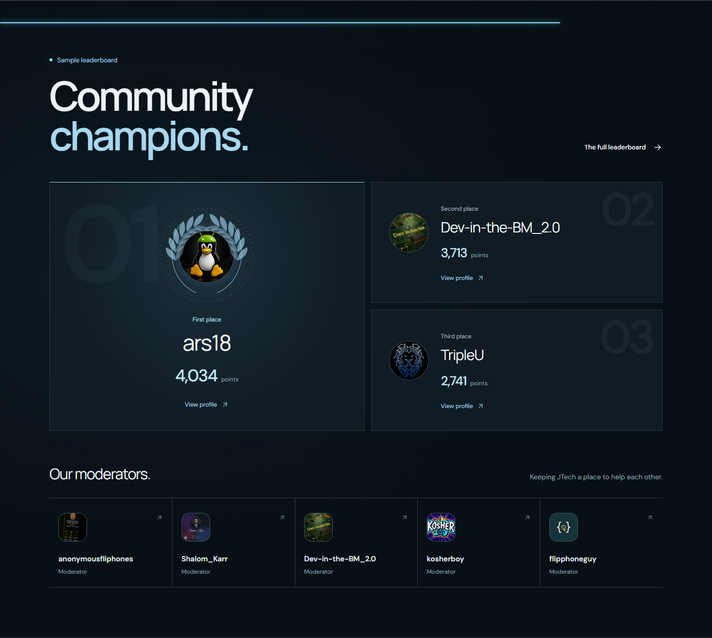
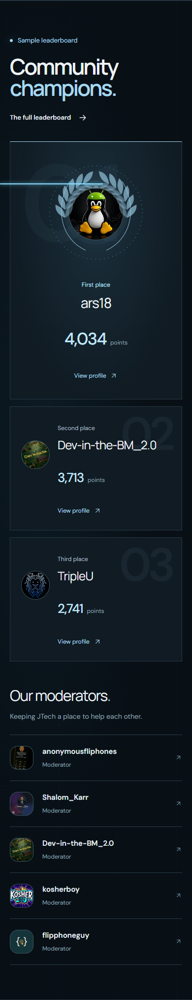
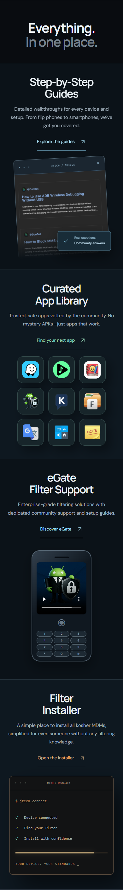
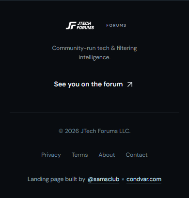

# Redesign previews

These captures use the local mock-data preview. They do not show a deployment or live forum statistics. See [local review instructions](../../LOCAL-PREVIEW.md) to try the interactions.

## Desktop

## Particle motion

A compact recording of the seven-shape sequence. The local preview renders more frames than this GIF.

## Horizontal story

Scrolling down moves these full-width scenes sideways while the section stays beneath the header.

## Mobile

## Community champions and moderators

The new section gives first place a large laurel portrait, displays exact scores, and links every champion and moderator to their forum profile. These captures use public API response snapshots from September 9, 2026 in the local preview (the sample label remains visible). Rankings in production continue to load from the existing monthly leaderboard API. The fixed navigation is hidden only for these section screenshots.

Verified at 1440px and 390px: three champions, five moderators, working avatar images, no horizontal overflow or browser exceptions. Empty and failed leaderboard responses retain an accessible message and the full leaderboard link. Motion respects reduced-motion preferences.

The separate conversation feed was investigated: both the hosted `/api/forum/latest` endpoint and the Cloud Run `/forum/latest` endpoint return HTTP 403 with a Cloudflare block page from the upstream forum. About and leaderboard requests succeed. No API or Cloudflare settings were changed; the existing conversation fallback remains. A forum administrator would need to investigate the blocking Cloudflare rule to restore this feed.

## Mobile experience redesign

The mobile layout now uses a centered hero without the particle canvas, followed by four vertical resource scenes. Typography, touch targets, and spacing have been adjusted throughout. Desktop keeps the existing animated horizontal story. These screenshots use the local sample-data preview at 390px; fixed navigation is hidden only in section captures.

Older screenshots above document earlier iterations. Follow LOCAL-PREVIEW.md for the current routes and review steps.
